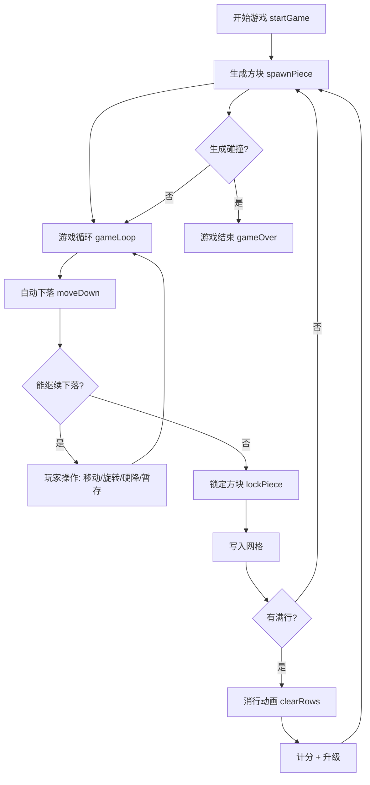
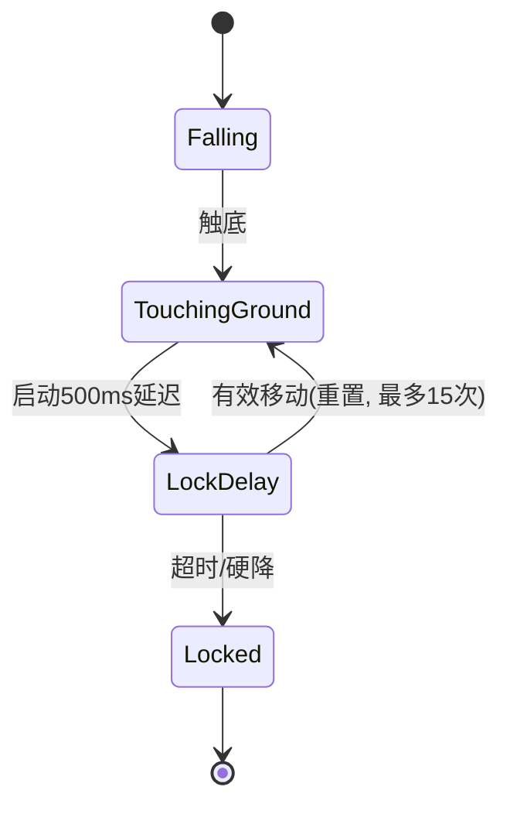
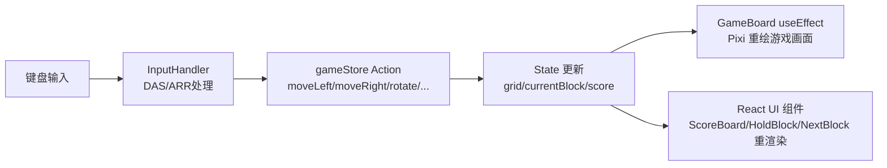

# Tetris Game

一款基于 React + TypeScript + Pixi.js 的现代俄罗斯方块游戏。

## 🎮 游戏特性

- **经典玩法**：传统俄罗斯方块游戏规则
- **现代界面**：简洁美观的 UI 设计
- **流畅动画**：基于 Pixi.js 的高性能渲染
- **粒子动画背景**：主菜单和设置页面的 Canvas 粒子漂浮效果
- **音效系统**：基于 Howler.js 的游戏音效
- **难度选择**：简单 / 普通 / 困难三档可选
- **DAS/ARR 灵敏度**：延迟自动移位（DAS）和自动重复速率（ARR）可调
- **积分历史**：最高分记录保存与查看
- **键盘导航**：菜单按钮支持键盘焦点导航
- **完整功能**：
  - 方块预览（Next）
  - 方块暂存（Hold）
  - 幽灵方块（Ghost）
  - 分数和等级系统
  - 碰撞检测
  - 行消除动画

## 🛠️ 技术栈

| 技术 | 版本 | 说明 |
|------|------|------|
| React | 18.2.0 | 前端框架 |
| TypeScript | 5.1.6 | 类型安全 |
| Pixi.js | 7.3.3 | 2D 渲染引擎 |
| Electron | 28.0.0 | 桌面应用框架 |
| Vite | 4.4.9 | 构建工具 |
| Zustand | 4.4.1 | 状态管理 |
| Howler.js | 2.2.3 | 音频引擎 |
| Vitest | 0.34.6 | 单元测试框架 |
| CSS3 | - | 样式设计 |

### 环境要求

- Node.js >= 18.0.0
- npm >= 9.0.0 或 yarn >= 1.22.0

### 安装步骤

```bash
# 克隆项目
git clone <repository-url>
cd TestNewma

# 安装依赖
npm install

# 启动开发服务器
npm run dev

# 构建生产版本
npm run build

# 预览生产版本
npm run preview
```

## 🚀 启动方式

- **`python3 run.py`** — 一键启动（推荐，自动清理 5173 端口 + 启动 Electron 桌面模式）
- **`npm run electron:dev`** — 手动启动 Electron 桌面模式
- **`npm run dev`** — 仅启动 Vite 开发服务器（浏览器预览）

- **`npm run electron:build`** — 编译 + electron-builder 生成安装包（输出到 `release/` 目录，支持 Win / Mac / Linux）
- **`npm run electron:pack`** — 仅打包不生成安装器（用于调试打包流程）

## 🎯 游戏操作

| 按键 | 功能 |
|------|------|
| ← / A | 左移 |
| → / D | 右移 |
| ↓ / S | 加速下落 |
| ↑ / W | 旋转 |
| Space | 硬降落（直接到底） |
| C / Shift | 暂存方块 |
| P | 暂停游戏 |
| R | 重新开始 |

## 📁 项目结构

```
src/
├── assets/                        # 静态资源
│   ├── audio/                     # 音效文件
│   └── images/                    # 图片资源
├── components/
│   ├── game/                      # 游戏组件
│   │   ├── GameBoard.tsx          # 游戏主画板（Pixi.js 渲染）
│   │   ├── GameBoard.css          # 游戏画板样式
│   │   ├── HoldBlock.tsx          # 暂存方块显示
│   │   ├── NextBlock.tsx          # 下一个方块预览
│   │   ├── ScoreBoard.tsx         # 分数面板
│   │   └── ScoreBoard.css         # 分数面板样式
│   └── ui/                        # UI 组件
│       ├── GameOver.tsx           # 游戏结束弹窗
│       ├── MainMenu.tsx           # 主菜单页面
│       ├── MainMenu.css           # 主菜单样式
│       ├── PauseMenu.tsx          # 暂停菜单
│       ├── PauseMenu.css          # 暂停菜单样式
│       ├── ScoreHistory.tsx       # 积分历史
│       ├── ScoreHistory.css       # 积分历史样式
│       ├── Settings.tsx           # 设置页面
│       ├── Settings.css           # 设置页面样式
│       └── useKeyboardNavigation.ts # 键盘导航 Hook
├── game/
│   └── core/                      # 游戏核心逻辑
│       ├── __tests__/             # 单元测试
│       │   ├── Block.test.ts      # 方块逻辑测试
│       │   ├── Grid.test.ts       # 网格系统测试
│       │   ├── Level.test.ts      # 等级系统测试
│       │   ├── LineClear.test.ts  # 行消除逻辑测试
│       │   └── Score.test.ts      # 计分系统测试
│       ├── Block.ts               # 方块逻辑类
│       ├── Collision.ts           # 碰撞检测
│       ├── Ghost.ts               # 幽灵方块计算
│       ├── Grid.ts                # 网格系统
│       ├── Hold.ts                # 暂存逻辑
│       ├── InputHandler.ts        # 输入处理（DAS/ARR）
│       ├── Level.ts               # 等级系统
│       ├── LineClear.ts           # 行消除逻辑
│       ├── ParticleSystem.ts      # 粒子系统
│       └── Score.ts               # 计分系统
├── hooks/                         # 自定义 Hooks
│   └── useParticleBackground.ts   # 粒子动画背景 Hook
├── main/                          # Electron 主进程
│   ├── main.ts                    # 主进程入口
│   └── preload.ts                 # 预加载脚本
├── renderer/                      # 渲染进程
│   └── index.tsx                  # 渲染进程入口
├── store/                         # 状态管理
│   ├── audioStore.ts              # 音频状态
│   ├── gameStore.ts               # 游戏状态
│   └── uiStore.ts                 # UI 状态
├── styles/
│   └── App.css                    # 全局样式
├── types/
│   └── index.ts                   # 类型定义
├── utils/
│   └── AudioManager.ts            # 音频管理器
├── App.tsx                        # 应用根组件
└── index.css                      # 全局基础样式
```

## 🏗️ 架构概览

### 游戏循环机制

游戏循环由 `requestAnimationFrame` 驱动，运行在 `gameStore` 内部：

1. **主循环**：`gameLoop()` 每帧计算 delta time，累加到下落计时器
2. **下落间隔**：当累积时间超过当前等级对应的下落间隔时，触发方块自动下落一格，计时器重置
3. **Lock Delay**：方块触底后不会立即锁定，而是启动 500ms 延迟窗口，允许玩家在此期间继续移动/旋转方块；每次有效移动重置延迟计时器，最多重置 15 次
4. **暂停/恢复**：通过 `gameStatus` 状态控制循环的启停，暂停时取消 `requestAnimationFrame`

### 核心流程图

#### 游戏主流程



#### Lock Delay 状态机



#### 输入处理流程


### Zustand 状态流

项目使用三个独立的 Zustand Store，各司职、单向数据流：

| Store | 职责 | 关键状态 |
|-------|------|----------|
| **gameStore** | 游戏状态 + 核心逻辑 | 游戏状态、分数、等级、方块、网格、游戏循环、DAS/ARR 配置 |
| **uiStore** | 页面/弹窗切换 | 当前页面（menu/playing/settings/scoreHistory）、弹窗开关 |
| **audioStore** | 音频控制 | 音效开关、音量、背景音乐状态 |

**单向数据流**：用户操作 → Store Action → State 更新 → React 组件订阅重渲染

### 渲染分层

项目采用 **Pixi.js Canvas + React DOM** 双层渲染架构：

```
┌─────────────────────────────────────┐
│  React DOM 层（UI 覆盖层）           │  z-index: 10+
│  MainMenu / Settings / PauseMenu    │
│  GameOver / ScoreBoard / HoldBlock  │
├─────────────────────────────────────┤
│  Pixi.js Canvas 层（游戏画面）       │  z-index: 0
│  GameBoard → Pixi Application       │
│  方块渲染 / 网格 / 幽灵块 / 粒子    │
└─────────────────────────────────────┘
```

- **GameBoard 组件**是桥接层：创建 Pixi `Application` 并挂载到 `<canvas>`，同时通过 `useEffect` 订阅 `gameStore` 状态变化，将状态同步到 Pixi 渲染
- **UI 组件**通过 `position: absolute` + `z-index` 叠加在 Pixi 画布之上，由 React DOM 直接渲染
- **粒子背景**（`useParticleBackground`）使用独立 Canvas 2D，位于最底层

### 数据流向图

```
键盘输入
  │
  ▼
App.tsx handleKeyDown()
  │
  ▼
gameStore actions (moveLeft / moveRight / rotate / hardDrop / ...)
  │
  ▼
gameStore state 更新 (grid / currentBlock / score / ...)
  │
  ├──▶ GameBoard useEffect 订阅 → Pixi 重绘游戏画面
  │
  └──▶ React UI 组件 (ScoreBoard / HoldBlock / NextBlock) 重渲染
```

## 🔧 开发说明

### 核心模块

#### game/core — 游戏核心逻辑

**Block.ts** - 方块控制
- 处理方块的移动、旋转
- 管理方块形状定义与状态

**Collision.ts** - 碰撞检测
- 方块与边界、已锁定方块的碰撞判定
- 旋转踢墙检测

**Ghost.ts** - 幽灵方块计算
- 计算当前方块硬降落后的投影位置

**Grid.ts** - 网格系统
- 游戏网格管理
- 方块锁定到网格
- 行消除检测
- 游戏结束判断

**Hold.ts** - 暂存逻辑
- 方块暂存与交换
- 暂存冷却控制

**InputHandler.ts** - 输入处理
- 键盘输入映射
- DAS（延迟自动移位）和 ARR（自动重复速率）实现

**Level.ts** - 等级系统
- 等级提升规则
- 下落速度随等级递增

**LineClear.ts** - 行消除逻辑
- 满行检测与消除
- 消除动画触发

**ParticleSystem.ts** - 粒子系统
- 消行粒子特效生成与更新

**Score.ts** - 计分系统
- 消行得分计算
- 连击与等级加成

#### store — 状态管理

**gameStore.ts** - 游戏状态
- 游戏状态（运行/暂停/结束）
- 分数、等级、难度
- 当前/下一个/暂存方块
- 游戏循环控制
- DAS/ARR 灵敏度配置

**audioStore.ts** - 音频状态
- 音效开关与音量控制
- 背景音乐状态

**uiStore.ts** - UI 状态
- 当前页面/弹窗切换
- UI 交互状态

#### hooks — 自定义 Hooks

**useKeyboardNavigation.ts** - 键盘导航
- 菜单按钮的键盘焦点导航

**useParticleBackground.ts** - 粒子动画背景

Canvas 粒子漂浮动画 Hook，用于主菜单和设置页面的背景效果。

```tsx
const canvasRef = useRef<HTMLCanvasElement>(null);
useParticleBackground(canvasRef);

// 自定义参数
useParticleBackground(canvasRef, {
  maxParticles: 120,
  color: { inner: 'rgba(255,255,255,0.9)', outer: 'rgba(100,200,255,0)' },
  speedY: [-3, -1],
});
```

| 参数 | 类型 | 默认值 | 说明 |
|------|------|--------|------|
| maxParticles | `number` | `80` | 粒子最大数量 |
| color | `{ inner: string; outer: string }` | `{ inner: 'rgba(0,255,255,0.8)', outer: 'rgba(0,100,255,0)' }` | 粒子径向渐变颜色 |
| speedY | `[number, number]` | `[-2, -0.5]` | 垂直速度范围，负值向上 |
| speedX | `[number, number]` | `[-0.5, 0.5]` | 水平速度范围 |
| size | `[number, number]` | `[1, 3]` | 粒子半径范围 |
| life | `[number, number]` | `[300, 700]` | 粒子生命周期帧数范围 |

#### utils — 工具模块

**AudioManager.ts** - 音频管理器
- 基于 Howler.js 的音频播放封装
- 音效预加载与播放控制

### 添加新方块类型

1. 在 `Block.ts` 中定义新形状的矩阵
2. 在 `gameStore.ts` 中添加颜色配置
3. 更新随机生成逻辑

### 修改游戏规则

1. 调整 `gameStore.ts` 中的游戏参数（速度、难度等）
2. 修改 `Collision.ts` 中的碰撞检测逻辑
3. 更新 `Score.ts` 中的计分规则

### 代码规范

- **`npm run lint`** — ESLint 检查 `src` 目录下的 `.ts` / `.tsx` 文件，输出代码风格与潜在问题
- **`npm run lint:fix`** — ESLint 自动修复可安全修复的问题（如格式化、简单规则违规）
- **`npm run type-check`** — TypeScript 类型检查（`tsc --noEmit`），不生成文件仅校验类型正确性
- **`npm run test`** — 运行 Vitest 单元测试
- **`npm run test:coverage`** — 运行测试并生成覆盖率报告

## 🐛 已知问题

- 某些浏览器下 Pixi.js 渲染可能有性能差异
- 移动端触摸控制尚未实现

## 📝 更新日志

### v1.2.1
- 修复 `lockPiece` 闭合括号缺失导致的编译错误
- 修复消行后游戏冻结的问题
- 修复 `GameBoard` useEffect 冗余括号

### v1.2.0
- 新增 Vitest 单元测试框架
- 新增 5 个核心模块单元测试（Block / Grid / Level / LineClear / Score）
- 修复消行特效 Lightning 不显示的 bug
- 修复消行特效 Combo 数字失效的 bug
- 清理 coverage 目录并加入 .gitignore

### v1.1.0
- 新增粒子动画背景（主菜单 + 设置页面）
- 提取 `useParticleBackground` Hook，支持可配置粒子数量、颜色、速度
- 新增音效系统（基于 Howler.js）
- 新增难度选择（简单 / 普通 / 困难）
- 新增 DAS/ARR 灵敏度调节
- 新增积分历史记录与查看
- 新增菜单键盘导航（`useKeyboardNavigation` Hook）
- 设置页面支持粒子动画背景

### v1.0.0
- 初始版本发布
- 完整游戏功能实现
- 响应式布局支持

## 📄 许可证

MIT License

## 👥 贡献指南

欢迎提交 Issue 和 Pull Request！

1. Fork 本项目
2. 创建功能分支 (`git checkout -b feature/AmazingFeature`)
3. 提交更改 (`git commit -m 'Add some AmazingFeature'`)
4. 推送到分支 (`git push origin feature/AmazingFeature`)
5. 开启 Pull Request

---

**Enjoy Playing! 🎮**